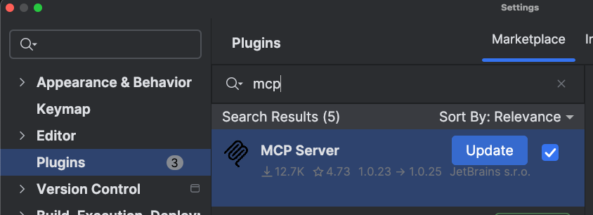
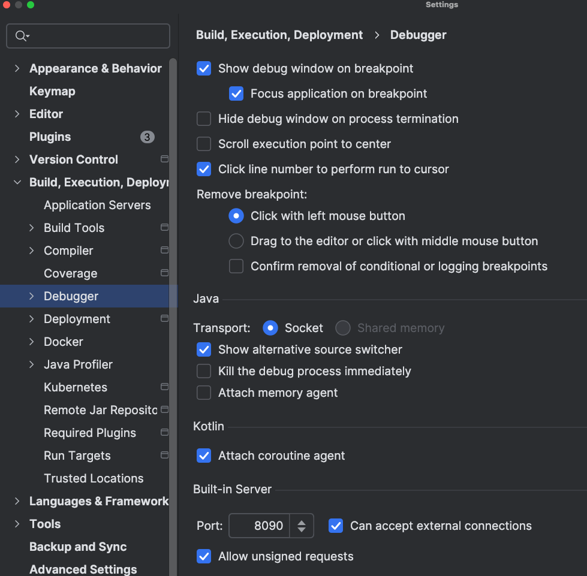
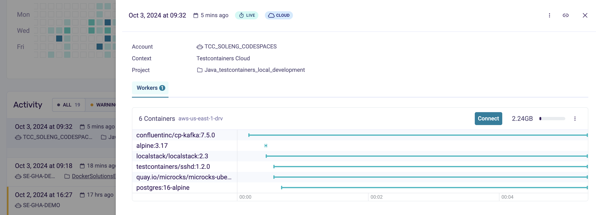
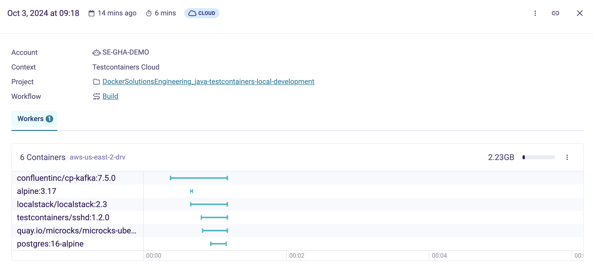

# Java Local Development Workshop

This repo will demo how to use Testcontainers \([https://www.testcontainers.com](https://www.testcontainers.com)\) in your Java application development process.

We will explore a Spring Boot application and show how to:
* Use Testcontainers for provisioning application dependent services like PostgreSQL, Kafka, LocalStack for local development
* Use [Testcontainers Desktop](https://testcontainers.com/desktop/) for local development and debugging
* Use Testcontainers Cloud as a contaner runtime for local development and CI workflows

# Setting up jetbrains-mcp

To get started with the jetbrains-mcp (Model Context Protocol) for IntelliJ IDEA, follow these steps:

1. Install the MCP Server plugin for IntelliJ IDEs
  - Go to IntelliJ -> Settings -> Plugins 
  - Add the [MCP Server for IntelliJ IDEs](https://plugins.jetbrains.com/plugin/26071-mcp-server) plugin to your IDE
  - This plugin allows the IDE to work with the MCP server

2. Configure the built-in server settings in IntelliJ IDEA:
  - Go to IntelliJ -> Settings -> Build, Execution, Deployment -> Debugger 
  - Change the port of the built-in server to 8090 (or another available port)
  - Enable "Can accept external connections" option (you might need to reopen the setting window to make this checkbox available)
  - Enable "Allow unsigned requests" option

3. Important Configuration Parameters:
  - Make sure to provide the correct IDEA port in your configuration
  - Use `host.docker.internal:host-gateway` in your Docker configuration to allow the MCP server to connect to your IDE

## Gordon Docker Compose Configuration (WIP)

Example configuration (as seen in gordon-mcp.yml):
```yaml
services:
  mcp_jetbrains:
    image: annachernyshova809/mcp-jetbrains:v1.1
    environment:
      - IDE_PORT=8090
      - LOG_ENABLED=true
    extra_hosts:
      - "host.docker.internal:host-gateway"
    x-mcp-autoremove: false
```

The `host.docker.internal:host-gateway` setting is crucial for the Docker container to be able to communicate with your host machine where the IDE is running.

## Claude Desktop Configuration

To use the jetbrains-mcp server with Claude Desktop, add the following configuration to your `claude_desktop_config.json` file:

```json
{
  "mcpServers": {
    "mcp-jetbrains": {
      "command": "docker",
      "args": [
        "run",
        "-i",
        "--rm",
        "--init",
        "--add-host=host.docker.internal:host-gateway",
        "-e",
        "IDE_PORT=8090",
        "-e",
        "LOG_ENABLED=true",
        "-e",
        "DOCKER_CONTAINER=true",
        "annachernyshova809/mcp-jetbrains:v1.1"
      ]
    }
  }
}
```

The file location depends on your operating system:
- macOS: `~/Library/Application Support/Claude/claude_desktop_config.json`
- Windows: `%APPDATA%/Claude/claude_desktop_config.json`

This configuration will allow Claude Desktop to communicate with your IntelliJ IDE through the MCP server.


## Running the app
1. Clone project or start a codespace workspace on the demo-state branch 
2. To demo the local development use case run the application locally letting Spring Boot and Testcontainers set up a containers for it: `./mvnw spring-boot:test-run`
3. Open the application in the browser: [link](http://localhost:8080/)
4. Explore the UI, add product. The application runs on the codespaces VM instance with a Postgres, Kafka, LocalStack and Mock of Inventory Service containers on TCC.
5. Open [Testcontainers Cloud dashboard](https://app.testcontainers.cloud/dashboard) and see the contaners created for the application
6. Highligt that you can [tag Project (Java_testcontainers_local_development) and Account (TCC_SOLENG_CODESPACES)](https://testcontainers.com/cloud/docs/#tag-test-sessions-by-project). In this example via env variables in the devcontainer.js 
```shell
"containerEnv": {
    "TC_CLOUD_TOKEN": "${localEnv:TC_CLOUD_TOKEN}",
    "TCC_PROJECT_KEY": "Java_testcontainers_local_development"
  }
``` 
7. Connect to the cloud worker 
8. Do `docker ps` and see containers running
* Optional: 
* get into postgers container `docker exec -it mypostgrescontainer sh` 
* login to postgres db `psql -h localhost -p 5432 -U test -d test`
* list tables `\dt`, or any other sql command, like list all products 
```sql
select * from test.public.products;
```
* `exit` container
9. Go back to the codespase and stop the application by `Ctr+C` in the terminal
10. Run application tests by `./mvnw clean test`
11. Go to the [Testcontainers Cloud dashboard](https://app.testcontainers.cloud/dashboard), explore containers started for the tests and then exited
12. Tell about Service accounts and how to [run Testcontainers test in CI with Testcontainers Cloud](https://www.testcontainers.cloud/ci)
13. Make a small change in the project, commit and push changes. Adding a comment is good enough.
14. Go to the latest [GHA build](https://github.com/DockerSolutionsEngineering/java-testcontainers-local-development/actions), rerun the job, and see CI build with the proper Project, Workflow, and Service account 
15. *Highlight Private registries and [show how to use them with Testcontainers Cloud](https://app.testcontainers.cloud/dashboard/settings)